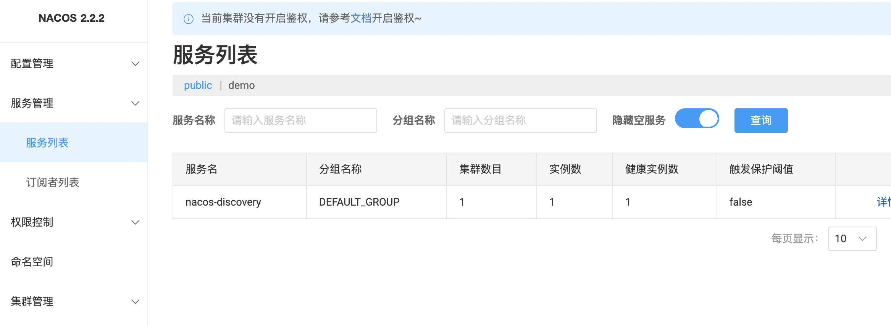
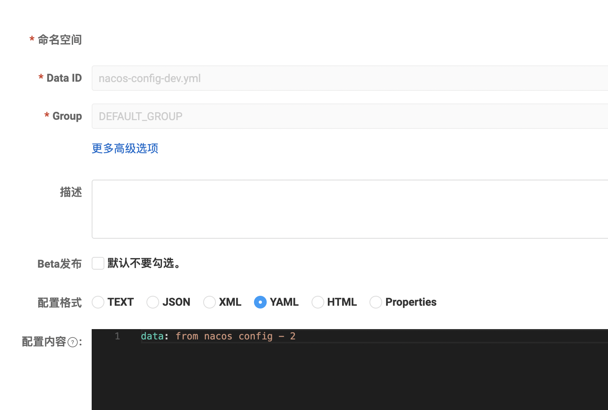

# Nacos

## nacos-server

### 下载

 版本： nacos-server 2.2.2 <br>
下载地址：https://github.com/alibaba/nacos/releases/tag/2.2.2

### 配置使用数据库

建表，表名：nacos

sql脚本，文件：`nacos/config/mysql-schema.sql`

修改配置

文件：`nacos/config/application.properties`

内容：

```properties
#*************** Config Module Related Configurations ***************#
### If use MySQL as datasource:
### Deprecated configuration property, it is recommended to use `spring.sql.init.platform` replaced.
spring.datasource.platform=mysql
spring.sql.init.platform=mysql

### Count of DB:
db.num=1

### Connect URL of DB:
db.url.0=jdbc:mysql://127.0.0.1:3306/nacos?characterEncoding=utf8&connectTimeout=1000&socketTimeout=3000&autoReconnect=true&useUnicode=true&useSSL=false&serverTimezone=UTC
db.user.0=root
db.password.0=123456
```

启动

```shell
cd nacos/bin
sh startup.sh -m standalone
```

关闭
```shell
sh shutdown.sh
```

看日志：

logs/start.out

### 鉴权


## spring-cloud-alibaba

指定版本

```groovy
ext {
    springCloudAlibabaVersion = "2022.0.0.0-RC2"
}
```

依赖管理

```groovy
dependencyManagement {
        imports {
            mavenBom "com.alibaba.cloud:spring-cloud-alibaba-dependencies:${springCloudAlibabaVersion}"
        }
    }
```

## discovery

- [Nacos discovery](https://github.com/alibaba/spring-cloud-alibaba/wiki/Nacos-discovery)

依赖

```groovy
dependencies {
    implementation 'com.alibaba.cloud:spring-cloud-starter-alibaba-nacos-discovery'
}
```

配置

```yaml
spring:
  application:
    name: nacos-discovery
  cloud:
    nacos:
      server-addr: 127.0.0.1:8848
```

编码

```java
@SpringBootApplication
@EnableDiscoveryClient
public class NacosDiscoveryApplication {

    public static void main(String[] args) {
        SpringApplication.run(NacosDiscoveryApplication.class, args);
    }

}
```



## config

依赖

```groovy
dependencies {
    implementation 'com.alibaba.cloud:spring-cloud-starter-alibaba-nacos-config'
}
```

配置

```yaml
spring:
  application:
    name: nacos-config
  cloud:
    nacos:
      server-addr: 127.0.0.1:8848
      config:
        file-extension: yml
  profiles:
    active: dev
```

DataId: nacos-config-dev.yml <br>
Group: DEFAULT_GROUP <br>



